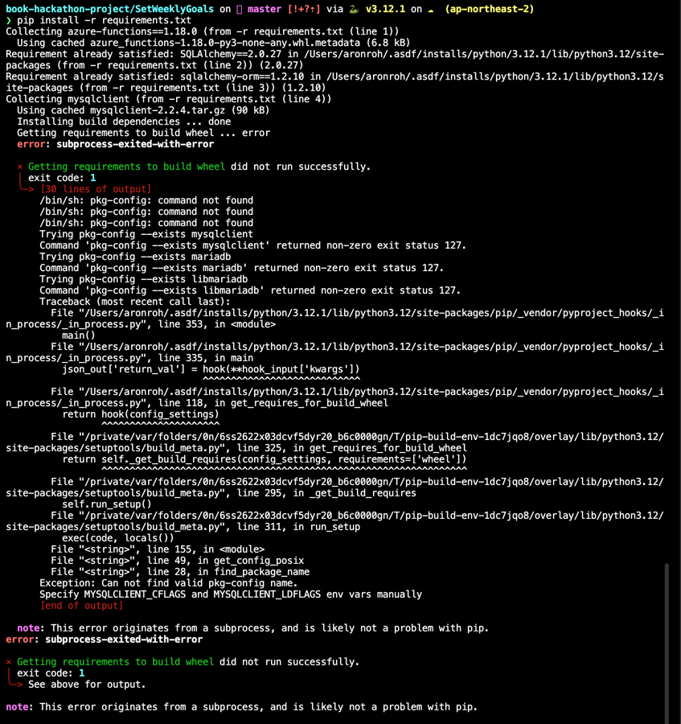

## 설치
```shell
pip install -r requirements.txt

```


## 로컬 실행하기

MySQL 실행이 필요합니다.
로컬 환경에서 Docker를 이용해 MySQL을 실행할 수 있습니다.


```shell
docker run -e MYSQL_ROOT_PASSWORD=password -e MYSQL_DATABASE=weekly_goals -p 3306:3306 -d mysql:8.3

DB_CONNECTION_STRING=mysql://localhost:3306/weekly_goals func host start
```

## 배포

```shell

az login

let "randomIdentifier=$RANDOM*$RANDOM%10000000000"
location="koreacentral"
resourceGroup="set-weekly-goals-$randomIdentifier"
storage="setweeklygoals$randomIdentifier"
functionApp="set-weekly-goals-app-$randomIdentifier"
dbName="setweeklygoals"
dbAdminUser="setweeklygoals"
# db admin 이름은 독자에 따라 변경해주세요.
dbAdminPassword="setweeklygoals1!"
# db admin 비밀번호는 독자에 따라 변경해주세요.
skuStorage="Standard_LRS"
skuMySQL="Standard_B1s"
functionsVersion="4"

# 리소스 그룹을 생성합니다.
echo "리소스 그룹 $resourceGroup 을 $location 리전에 생성합니다"
az group create --name "$resourceGroup" --location "$location"

# 리소스 그룹에 애저 스토리지 계정을 생성합니다.
echo "리소스 그룹 $resourceGroup 에 스토리지 계정을 생성합니다."
az storage account create --name $storage --location "$location" --resource-group $resourceGroup --sku $skuStorage

# 리소스 그룹에 서버리스 함수 앱을 생성합니다.
echo "$functionApp 서버리스 함수 앱을 생성합니다"
az functionapp create --name $functionApp --resource-group $resourceGroup --storage-account $storage --consumption-plan-location $location --functions-version $functionsVersion --runtime python --os-type Linux

# MySQL 서버를 생성합니다.
# public-acccess 0.0.0.0 임에 주의합니다.
echo "MySQL 서버 $storage 를 생성합니다."
az mysql flexible-server create --public-access 0.0.0.0 --resource-group $resourceGroup --name $storage --admin-user $dbAdminUser --admin-password $dbAdminPassword --location "$location" --sku-name $skuMySQL


# MySQL 서버에 데이터베이스를 생성합니다.
 az mysql flexible-server db create --resource-group $resourceGroup --database-name $dbName --server-name $storage

# Azure Function 함수를 배포합니다.
func azure functionapp publish $functionApp

# az functionapp show --resource-group $resourceGroup --name $functionApp --query outboundIpAddresses --output tsv


# 모든 과정을 진행하였다면 리소스를 삭제합니다.
az group delete --name $resourceGroup --yes --no-wait
```

## 에러 발생 시

### error: subprocess-exited-with-error 에러가 발생할 경우

아래 명령어를 실행해주세요.

```shell


```shell
# 우분투
sudo apt install default-libmysqlclient-dev pkg-config -y

# 맥
brew install pkg-config
```
